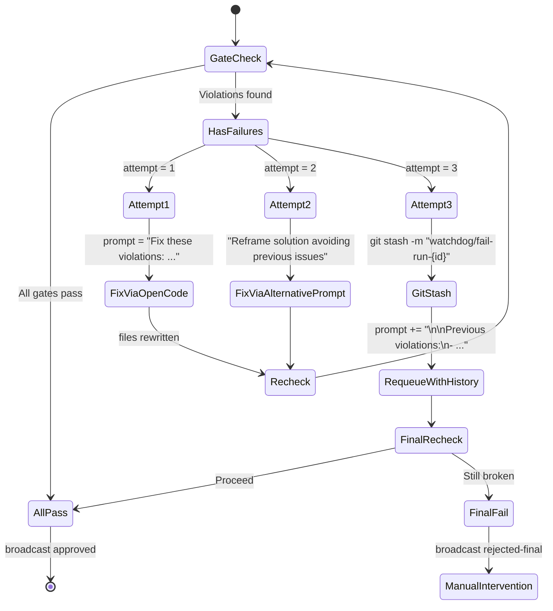

# Pass 1: Architect

# **BuilderWatchdog Architecture Design**  
*Senior Software Architect Review*

---

## **1. Component Map**

### **Server-Side (Hono / Bun)**
| Component | Path | Responsibility |
|--------|------|----------------|
| `watchdog.ts` | `server/watchdog/watchdog.ts` | Main watchdog orchestrator; receives pass completion webhook, runs gate pipeline |
| `gates/*.ts` | `server/watchdog/gates/` | Individual gate implementations (`ModelNameGate`, `MaxTokensGate`, etc.) |
| `types.ts` | `server/watchdog/types.ts` | Shared types: `WatchdogRun`, `Violation`, `GateResult`, `FileContext` |
| `db.ts` | `server/watchdog/db.ts` | DB operations: insert run, insert violations, query audit log |
| `sse-broadcast.ts` | `server/watchdog/sse-broadcast.ts` | Wraps existing SSE system to emit `watchdog:*` events |
| `routes/watchdog-webhook.ts` | `server/routes/watchdog-webhook.ts` | Hono route: `POST /api/watchdog/webhook` – entry point for runner notification |
| `utils/git-utils.ts` | `server/watchdog/utils/git-utils.ts` | Git operations: `git stash`, `git stash pop`, check status |
| `utils/type-checker.ts` | `server/watchdog/utils/type-checker.ts` | Wrapper for `bun tsc --noEmit` execution |
| `utils/import-resolver.ts` | `server/watchdog/utils/import-resolver.ts` | Resolves relative imports against filesystem |

### **Frontend (React / wouter)**
| Component | Path | Responsibility |
|--------|------|----------------|
| `WatchdogBadge.tsx` | `app/components/WatchdogBadge.tsx` | Displays real-time QA status per builder pass |
| `useWatchdogEvents.ts` | `app/hooks/useWatchdogEvents.ts` | Subscribes to `watchdog:status` SSE, updates UI |
| `ViolationList.tsx` | `app/components/ViolationList.tsx` | Shows gate failures in dev console or modal |
| `routes/qa-audit.tsx` | `app/routes/qa-audit.tsx` | Page to view historical violations (Labs nav) |
| `navRegistry.ts` | `app/lib/navRegistry.ts` | Add `'qa-audit'` route as `labs` |

### **DB**
| Table | File | Purpose |
|------|------|--------|
| `watchdog_runs` | `server/db/schema/watchdog.sql` | One row per builder pass checked |
| `watchdog_violations` | `server/db/schema/watchdog.sql` | Violations per file per run |

---

## **2. Integration Points**

### **Hook into `runner.ts`**
Modify `runner.ts` to call watchdog **after** each pass completes and files are written:

```ts
// In runner.ts – after spawnSync success and before next pass
const writtenFiles = getWrittenFilesSinceLastPass(); // via git or fs diff

// NEW: Notify watchdog
await fetch('http://localhost:3000/api/watchdog/webhook', {
  method: 'POST',
  headers: { 'Content-Type': 'application/json' },
  body: JSON.stringify({
    tenantId,
    sessionId,
    runId: builderRun.id,
    passNumber: currentPass.number,
    writtenFiles: writtenFiles.map(f => ({
      path: f.relativePath,
      content: await fs.readFile(f.absolutePath, 'utf8')
    })),
    projectRoot: builderRun.projectDir
  })
});
```

> ✅ **Why POST webhook?** Decouples watchdog from runner; allows async QA without blocking agent loop.

---

## **3. Gate Architecture**

### **Gate Interface**
```ts
// server/watchdog/types.ts
interface Gate {
  name: string;
  run(context: FileContext[], projectRoot: string): Promise<GateResult>;
}

interface GateResult {
  passed: boolean;
  violations: Violation[];
}
```

### **Execution Order & Short-Circuit Logic**
Gates run **sequentially**, but **no global short-circuit**. All gates execute to collect full violation report.

However:
- `TypeScriptGate` runs **last** (it's expensive)
- `ImportResolutionGate` runs **before** `TypeScriptGate` (catches resolvable errors early)

**Ordered Execution:**
1. `ModelNameGate`
2. `MaxTokensGate`
3. `RouteRegistrationGate`
4. `ImportResolutionGate`
5. `TypeScriptGate`

> 🚫 **No early exit**: Max transparency. Frontend needs full list of issues.

### **FileContext Type**
```ts
interface FileContext {
  path: string;         // relative to project root
  content: string;
  extension: '.ts' | '.tsx' | '.js' | '.jsx';
  isPage: boolean;      // ends with *Page.tsx
}
```

---

## **4. SSE Integration**

### **Event Coexistence Strategy**
Reuse **existing SSE broadcast system** with **namespaced event types**.

#### **Event Types**
| Event | Format | Consumer |
|------|-------|---------|
| `watchdog:start` | `{ runId, passNumber }` | Frontend: show spinner |
| `watchdog:violation` | `{ gate, filePath, message }` | Frontend: highlight file, add to list |
| `watchdog:retry` | `{ attempt: 1/2/3, strategy }` | Frontend: show retry badge |
| `watchdog:approved` | `{ runId }` | Frontend: green check |
| `watchdog:rejected-final` | `{ runId, violations }` | Frontend: show failure, offer manual |

#### **Broadcast Module**
```ts
// sse-broadcast.ts
export function broadcastWatchdogEvent(
  tenantId: string,
  sessionId: string,
  type: string,
  data: any
) {
  broadcastBuilderEvent(tenantId, sessionId, `watchdog:${type}`, data);
}
```

> ✅ **Same channel as builder** → No new connections. Frontend filters via `event.type.startsWith('watchdog:')`.

---

## **5. Retry & Rollback Flow**

### **State Machine: 3-Attempt Retry Strategy**



### **Git Stash Semantics**
- Only stash files **written in the failing pass**
- Use message: `watchdog/stash-{runId}-{passNumber}`
- On re-apply: `git stash pop` after OpenCode regenerates

> ⚠️ **Assumption**: No concurrent builder runs per tenant/session.

---

## **6. Technical Risks & Mitigations**

| Risk | Impact | Mitigation |
|------|--------|-----------|
| **TSC check slows builder loop** | High – may block agent progress | Run `bun tsc --noEmit` in worker thread; timeout at 15s; cache results if files unchanged |
| **Git stash conflicts during re-apply** | High – corrupts project state | Before `git stash pop`, verify no working dir changes; use `--index` to preserve patch integrity; fallback: manual recovery path in logs |
| **OpenCode ignores fix prompts, regresses** | Medium – infinite loop risk | Limit total watchdog retries per run (max 3); after final failure, require manual approve to continue; log prompt/response |

> ✅ **Defense in depth**: Watchdog never auto-approves after retry 3. Escalates to human.

---

## **7. DB Schema Sketch**

### `watchdog_runs`
| Column | Type | Null? | Description |
|-------|------|-------|-------------|
| id | INTEGER | NOT NULL (PK) | Autoincrement |
| builder_run_id | INTEGER | NOT NULL | FK to `builder_runs.id` |
| pass_number | INTEGER | NOT NULL | Pass index (1,2,3...) |
| tenant_id | TEXT | NOT NULL | For partitioning |
| session_id | TEXT | NOT NULL | |
| status | TEXT | NOT NULL | `pending`, `approved`, `rejected`, `final-failed` |
| attempt | INTEGER | NOT NULL | 1, 2, or 3 |
| project_root | TEXT | NOT NULL | Absolute path |
| created_at | DATETIME | NOT NULL | `CURRENT_TIMESTAMP` |
| updated_at | DATETIME | NOT NULL | On update |

### `watchdog_violations`
| Column | Type | Null? | Description |
|-------|------|-------|-------------|
| id | INTEGER | NOT NULL (PK) |
| run_id | INTEGER | NOT NULL | FK to `watchdog_runs.id` |
| gate | TEXT | NOT NULL | `ModelNameGate`, `MaxTokensGate`, etc. |
| file_path | TEXT | NOT NULL | Relative path |
| line_number | INTEGER | YES | First offending line |
| message | TEXT | NOT NULL | Human-readable error |
| severity | TEXT | NOT NULL | `error` (all are errors now) |
| resolved | BOOLEAN | NOT NULL | Default `false` |
| created_at | DATETIME | NOT NULL | `CURRENT_TIMESTAMP` |

> 🔁 **Migrations**: Add via `server/db/migrations/xxxx_watchdog_schema.sql`

```sql
-- Example migration
CREATE TABLE IF NOT EXISTS watchdog_runs (
  id INTEGER PRIMARY KEY AUTOINCREMENT,
  builder_run_id INTEGER NOT NULL,
  pass_number INTEGER NOT NULL,
  tenant_id TEXT NOT NULL,
  session_id TEXT NOT NULL,
  status TEXT NOT NULL,
  attempt INTEGER NOT NULL DEFAULT 1,
  project_root TEXT NOT NULL,
  created_at DATETIME NOT NULL DEFAULT CURRENT_TIMESTAMP,
  updated_at DATETIME NOT NULL DEFAULT CURRENT_TIMESTAMP
);

CREATE TABLE IF NOT EXISTS watchdog_violations (
  id INTEGER PRIMARY KEY AUTOINCREMENT,
  run_id INTEGER NOT NULL,
  gate TEXT NOT NULL,
  file_path TEXT NOT NULL,
  line_number INTEGER,
  message TEXT NOT NULL,
  severity TEXT NOT NULL DEFAULT 'error',
  resolved BOOLEAN NOT NULL DEFAULT 0,
  created_at DATETIME NOT NULL DEFAULT CURRENT_TIMESTAMP,
  FOREIGN KEY(run_id) REFERENCES watchdog_runs(id)
);

CREATE INDEX idx_watchdog_runs_builder ON watchdog_runs(builder_run_id);
CREATE INDEX idx_watchdog_violations_run ON watchdog_violations(run_id);
```

---

## ✅ Summary

**BuilderWatchdog** is a critical quality gate that prevents invalid code from progressing in autonomous agent flows.

This design:
- Integrates cleanly with existing **builder runner**, **SSE**, and **DB**
- Enforces **strict model governance** and **code correctness**
- Provides **transparency** via frontend badges and audit logs
- Uses **progressive recovery** with git-based rollback
- Mitigates performance and reliability risks

Ready for implementation.